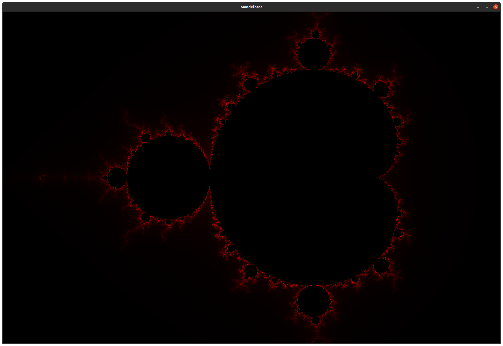
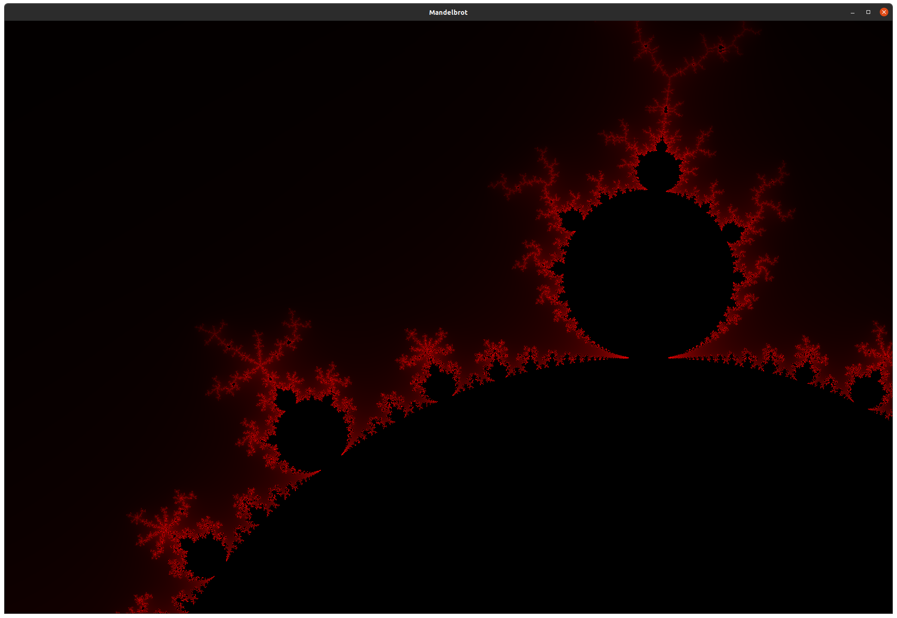
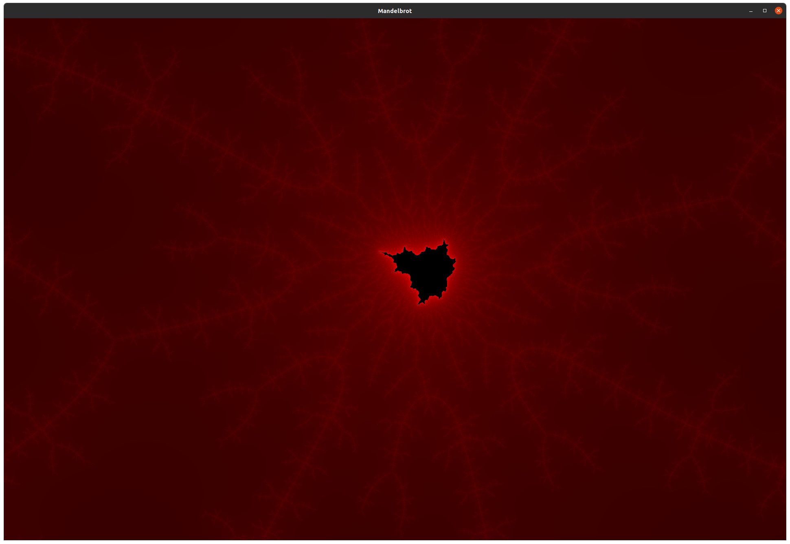

- "mandelbrot.cpp": Plots the Mandelbrot set. Use "W", "A", "S", "D" to navigate, "=" to zoom in and "-" to zoom out. Created using SFML.

	Compile with 
  > g++ mandelbrot.cpp -o mandelbrot_plotter -lsfml-graphics -lsfml-window -lsfml-system -fopenmp
  and run with 
  >./mandelbrot_plotter

Screenshots of Mandelbrot set obtained using Mandelbrot plotter (requires SFML and OpenMP).

- "mandelbrot_to_ppm.cpp": Creates a ppm file of the Mandelbrot set.

	Compile with 
  > g++ mandelbrot_to_ppm.cpp -o mandelbrot_ppm
  and run with 
  > ./mandelbrot_ppm
